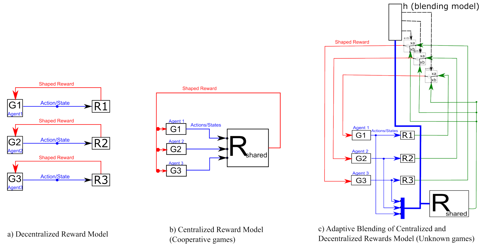
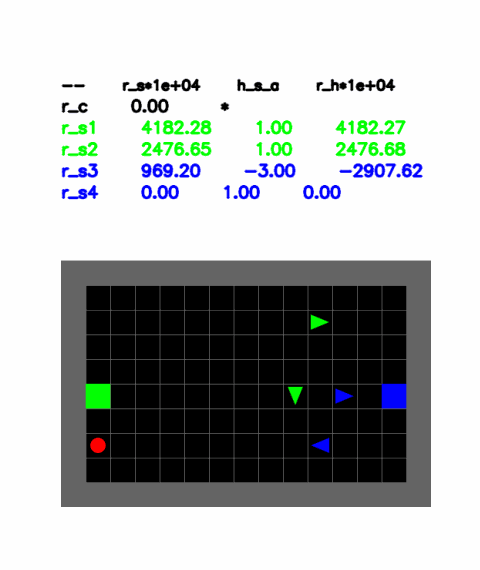
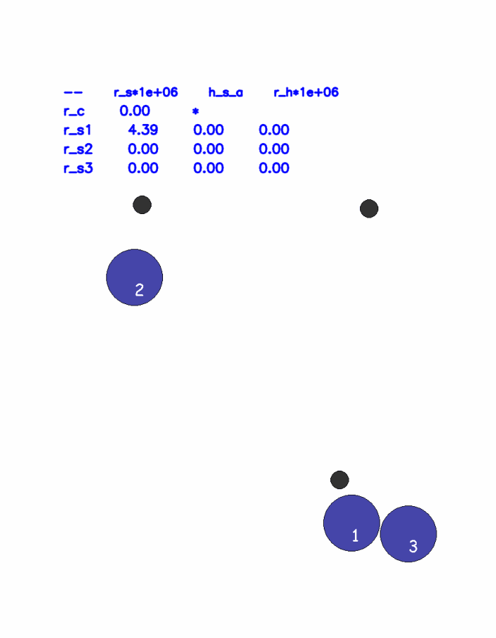
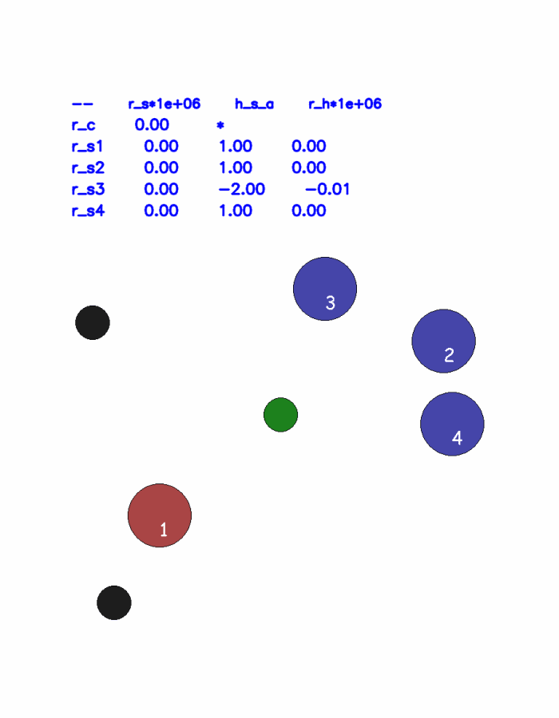

# Adaptive Learning of (De)centralized Rewards in Multi-Agents Systems


<p align="center" style="background-color:white;">
  
</p>


This code is related to the paper titled: 

<p align="center">
<b>Adaptive Learning of Centralized and Decentralized Rewards in Multi-agent Imitation Learning</b>
</p>

To appear in PAAMS24.

## Installation:
`pip install -r requirements.txt`

## Citation:

PDF of the paper is [avaliable here](paper.pdf)

*Will change later* 


```bibtex
@InProceedings{yousif2024_2,
    author="Yousif, Yasin and Müller, Jörg",
    title="Adaptive Learning of Centralized and Decentralized Rewards in Multi-agent Imitation Learning",
    booktitle="Advances in Practical Applications of Agents, Multi-Agent Systems.",
    year="2024",
    publisher="Springer Nature Switzerland",
    address="Cham",
    note="To appear"
}
```


## Videos of the results:

Tests are done on three environments. The following videos shows the learned policies at work along with the learned rewards values in the upper part.

**Football Environment**



**Spread Environment**




**Adverserial Environment**




## Contribute

For discussing of issues and problems running the code, please consider creating an issue


